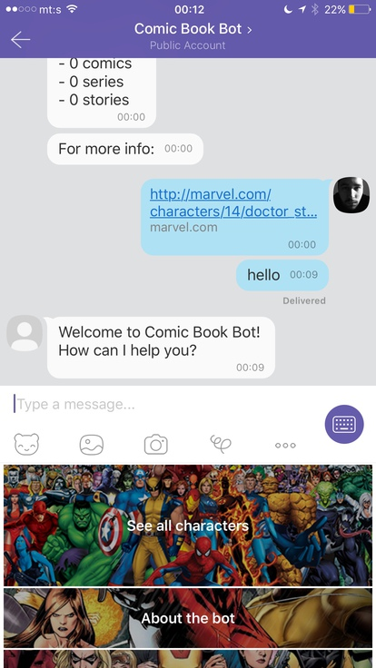
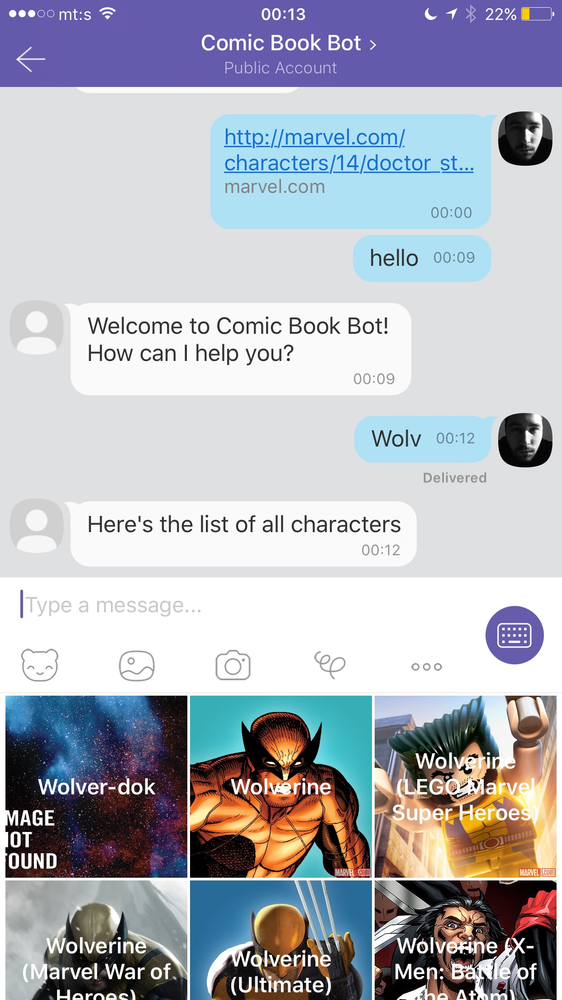
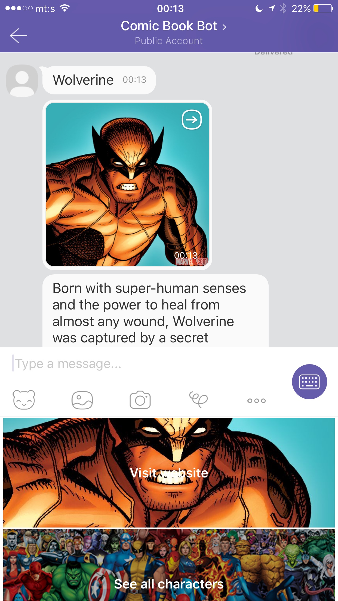
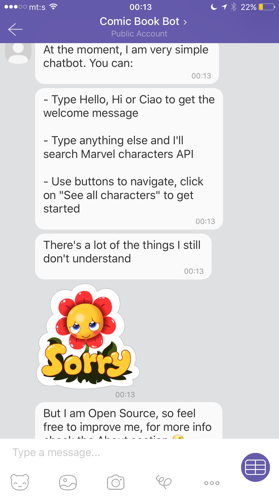

# Comic Book Bot

A simple Viber chatbot that connects to Marvel API and shows an info about Marvel characters.

## Talk to it on Viber

Public account is available [here](http://www.viber.com/comicbookbot).

Just send Hi, Hello or Ciao.

If you are visiting this page from mobile, here's the deep link: [Hello, Comic Book Bot](viber://pa?chatURI=comicbookbot&text=hello)

## Installation

If you want to run your own version, follow these steps:

1. Go to [Marvel Developer portal](https://developer.marvel.com) and get public and private keys;
2. Run `claudia create --region us-east-1 --api-module bot --configure-bot` and past both keys;
3. Signup for Viber Public Account and get the link;
4. Run `claudia update --configure-viber-bot` and paste Viber App key
5. Test your bot :)

## How it looks

## 